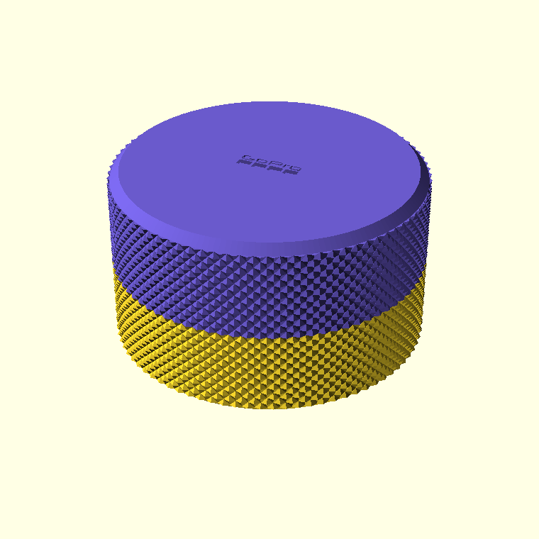
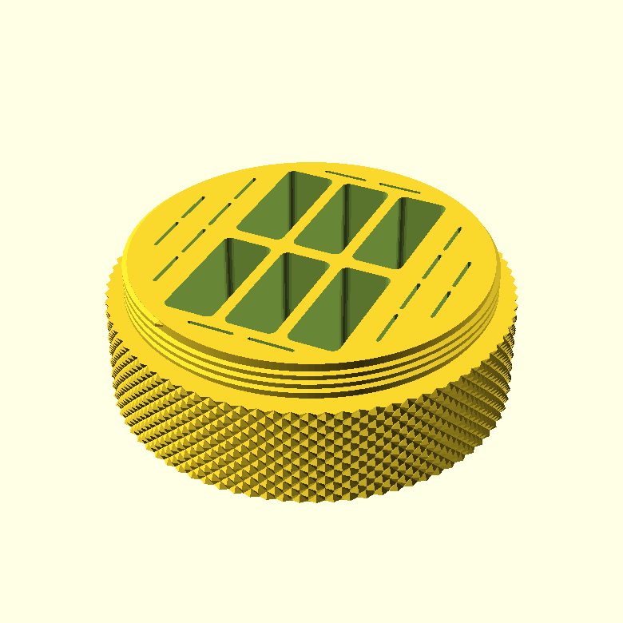
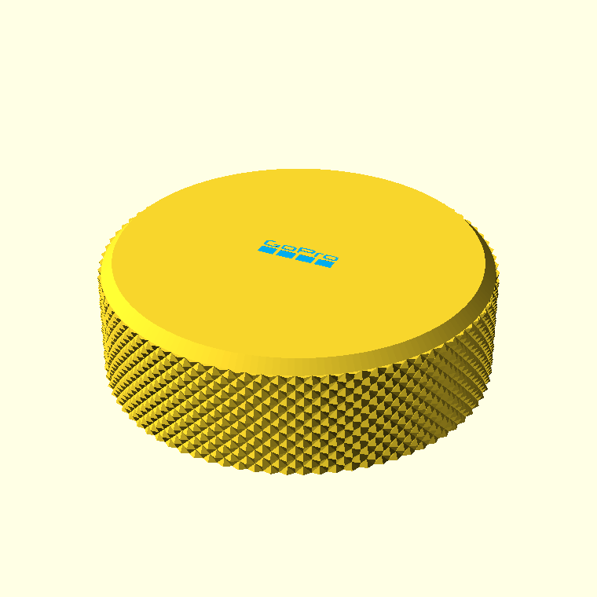
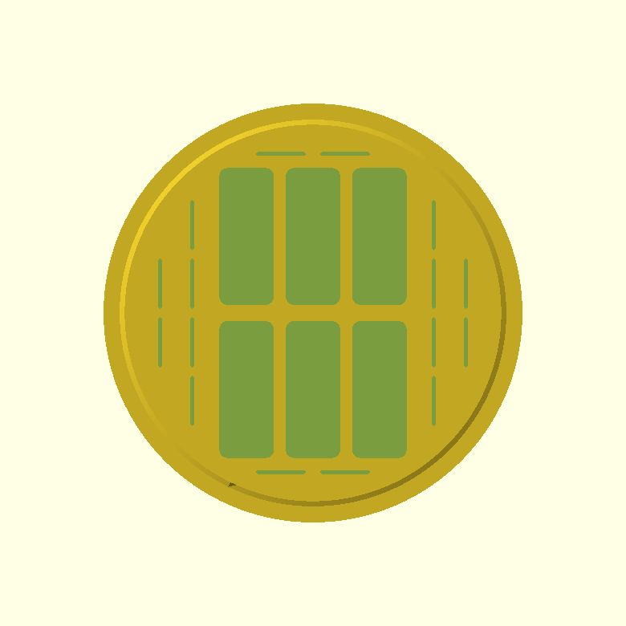

# GoPro Battery & SD Card Case

A screw-top cylindrical case that holds **6 GoPro batteries** and **16 microSD
cards** — no camera. Parametric OpenSCAD, designed for FDM printing.



| Base | Lid |
| --- | --- |
|  |  |

Top view of the base pockets:



## Design

- **Body:** solid cylinder, ~104 mm outer diameter, 40 mm tall. Pockets are cut
  from the top face; batteries and cards sit proud so they can be pulled out.
- **Batteries:** 6 pockets (34 × 13.5 mm, 29 mm deep), 3 × 2 grid.
- **microSD:** 16 slots (12.5 × 1 mm, 10 mm deep), spread away from the battery
  block into the free space (side columns plus slots above and below the
  batteries) so each card can be pinched out.
- **Lid:** screws on over a reduced-diameter threaded neck so it sits flush with
  the body. Provides 18 mm of vertical relief above the body top to clear the
  proud batteries/cards.
- **Thread:** ACME, 2.5 mm pitch, 10 mm engagement.
- **Knurling:** diamond knurl on the outer walls of both parts (not the base
  bottom face).
- **Edges:** smooth 45° chamfer on the base bottom rim and the lid top rim.
- **Logo:** the GoPro logo is inlaid flush into the lid top (a shallow pocket
  plus a matching inlay), so it can be printed in a second filament and feels
  smooth to the touch. Toggle with `logo_enable`.

All dimensions are parameters at the top of the `.scad` file — battery/card
sizes, counts, thread pitch, relief, knurl, chamfer and logo are all adjustable.

## Dependencies

- [OpenSCAD](https://openscad.org/) 2021.01 or newer.
- [BOSL2](https://github.com/BelfrySCAD/BOSL2) for the ACME thread and diamond
  knurling. Install it into your OpenSCAD library path:

  ```
  git clone https://github.com/BelfrySCAD/BOSL2 \
    ~/.local/share/OpenSCAD/libraries/BOSL2
  ```

## Rendering / exporting

The `part` parameter selects what to build: `base`, `lid`, `logo`, `cap_logo`
(lid + logo preview), `assembly`, `closed`, `cutaway`, or `slab`
(cross-section).

```
# STLs for printing
openscad -o base.stl -D 'part="base"' gopro_battery_case.scad
openscad -o lid.stl  -D 'part="lid"'  gopro_battery_case.scad
openscad -o logo.stl -D 'part="logo"' gopro_battery_case.scad   # 2nd filament
```

Both parts render as manifold solids and are print-ready. Print the lid
open-side-down; no supports needed. The knurl adds a dense mesh, so a full CGAL
render takes a few seconds.

### Two-colour lid

`lid.stl` already contains the logo pocket, and `logo.stl` is the matching inlay
(top face flush with the lid). To print the logo in a second filament, load
**both** `lid.stl` and `logo.stl` into your slicer at the same origin (import as
a single object / "load as parts"), assign a different filament to `logo.stl`,
and slice. On a single-nozzle printer use your slicer's multi-material or
paint-by-object feature; on an MMU/AMS it just works. Set `logo_enable=false`
for a plain lid.

## Logo asset

`GoPro_logo_light.svg` is the GoPro logo from
[Wikimedia Commons](https://commons.wikimedia.org/wiki/File:GoPro_logo.svg).
"GoPro" and the logo are trademarks of GoPro, Inc.; included here for a
personal-use replica case.
